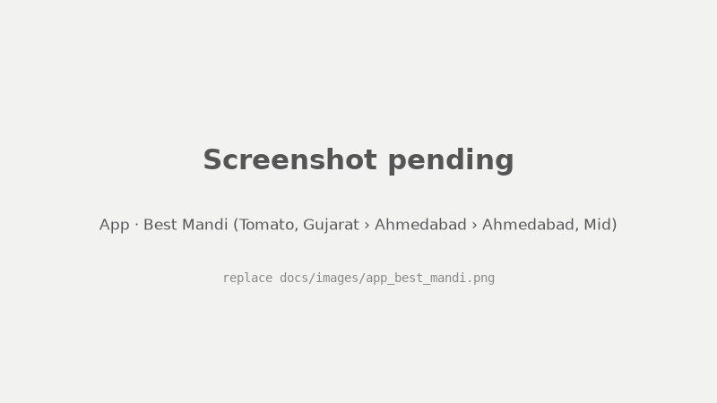
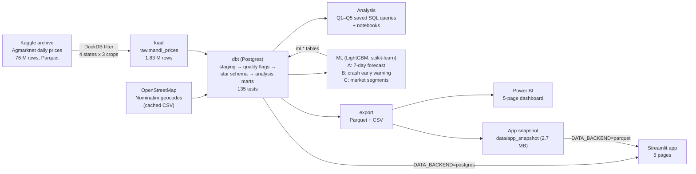
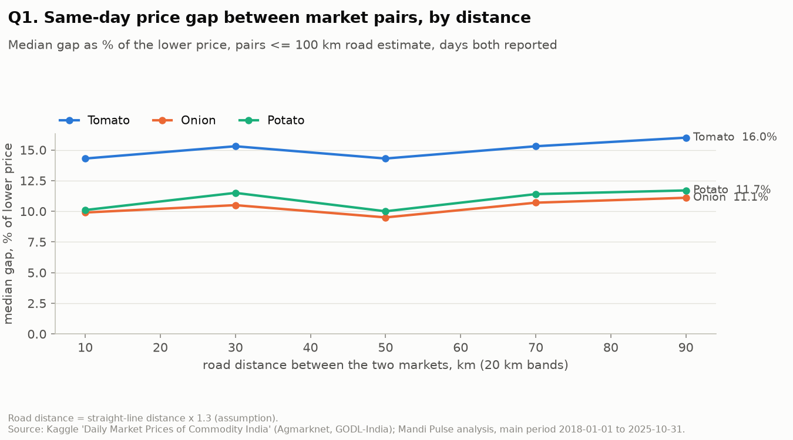
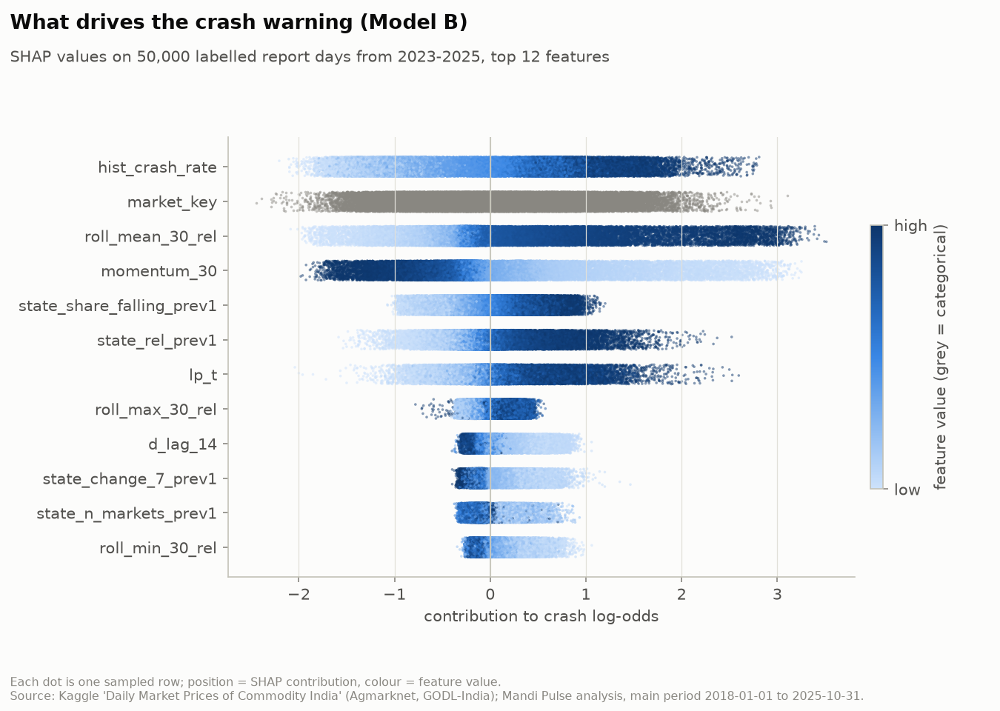
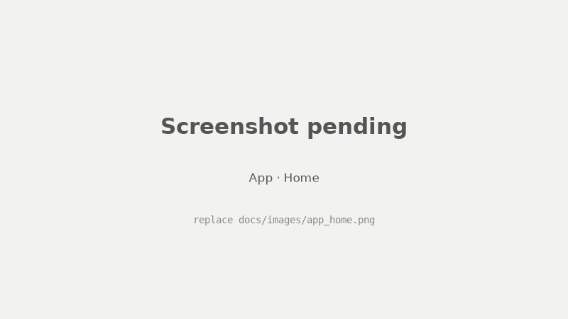
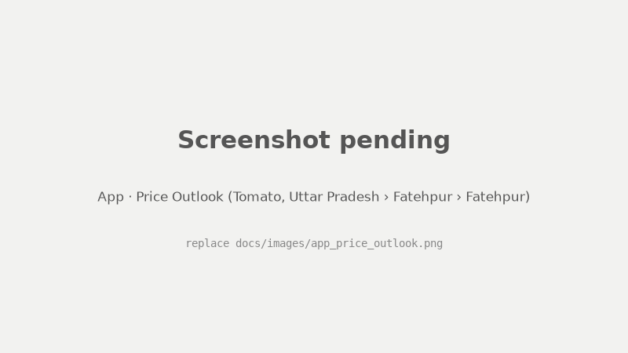
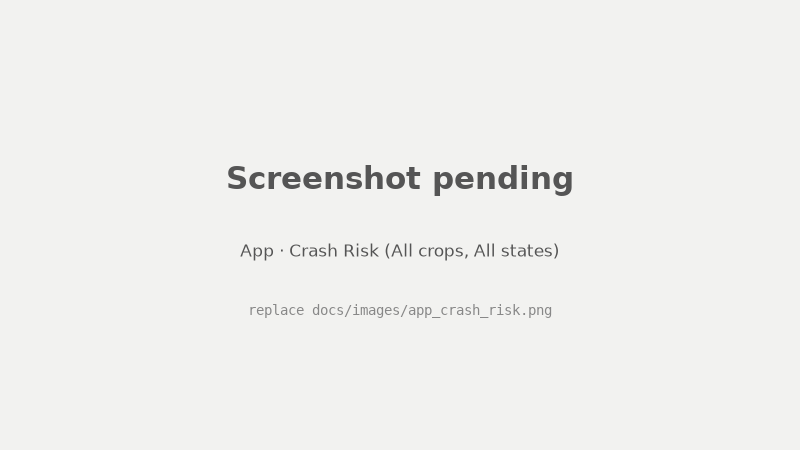
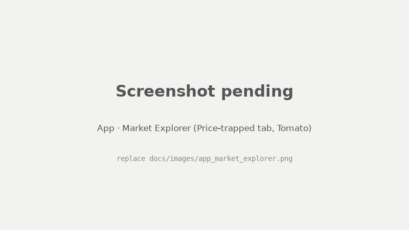
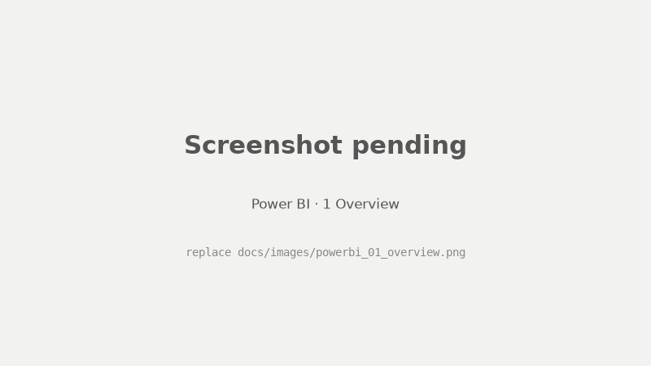
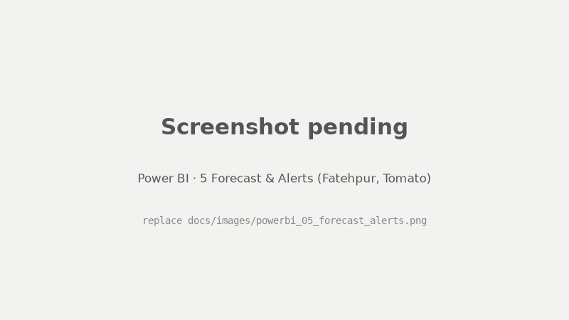

# Mandi Pulse

**"Google Flights for farmers' vegetable prices."** Mandi Pulse answers three questions:
- Which mandi (wholesale market) gives the best price for a crop this week, *after* transport and fees?
- Is a price crash coming?
- Which districts are stuck with low prices?

It covers tomato, onion and potato in Maharashtra, Madhya Pradesh, Uttar Pradesh and Gujarat, 2018–2025.



**Links:**
- Results: [Phase 3 findings](reports/PHASE3_FINDINGS.md) · [ML report](reports/ML_REPORT.md) · [Insights brief](reports/INSIGHTS_BRIEF.md)
- Docs: [Assumptions](docs/ASSUMPTIONS.md) · [Data sources](docs/DATA_SOURCES.md) · [Data dictionary](docs/DATA_DICTIONARY.md)
- Serving: [Power BI guide](powerbi/DASHBOARD_SPEC.md) · [Deploy the app](docs/DEPLOY.md) · [Progress log](PROGRESS.md)

---

## The problem

Indian farmers usually sell at the nearest mandi, often through a commission agent, without knowing what nearby mandis pay that day. The gaps are large. On a typical day, two tomato markets within 100 km of each other quote prices **15.3% apart (about ₹200 per quintal)**. Even after paying for transport and 6% commission and market fees, **at least one nearby mandi paid more on 33.8% of market-days**. Prices also crash hard and predictably: in December, 58% of tomato market-days start a crash.

## What I built



- **One command refreshes everything:** `python -m mandipulse pipeline` (load → dbt build → ml score → export).
- **Every reported number has a saved SQL query** in [`analysis/queries/`](analysis/queries/), with its output in [`reports/tables/`](reports/tables/).
- **The app runs anywhere without a database,** from a 2.7 MB committed snapshot. This makes it deployable on Streamlit Community Cloud.

## Key findings

Each finding is shown as a **range across robustness versions**: (a) the default; (b) without district-centroid geocodes; (c) including suspect-low series; (d, Q2 only) same-variety comparisons. Details: [PHASE3_FINDINGS.md](reports/PHASE3_FINDINGS.md), [robustness.sql](analysis/queries/phase3/robustness.sql).

1. **Nearby mandis disagree a lot.** The typical same-day gap between markets ≤ 100 km apart is **15.3% for tomato (₹200/qtl), 11.1% for potato and 10.5% for onion**.
   - The gap hardly grows with distance (tomato: 14.3% at 0–20 km, 16.0% at 80–100 km).
   - Robustness: tomato 15.2–15.4%, onion 10.5–10.6%, potato 10.1–11.1%.
   - Queries: [q1_spread_by_commodity](analysis/queries/phase3/q1_spread_by_commodity.sql), [q1_gap_by_distance](analysis/queries/phase3/q1_gap_by_distance.sql).
2. **After transport and fees, selling elsewhere often pays.** At least one mandi within 100 km paid more, by at least ₹100/qtl *and* 5%, on **33.8% of market-days** (mid costs).
   - Any *single* neighbour paid more on only **11.9%**.
   - Robustness: **24.4% (same variety only) to 33.9%**; across cost scenarios 24.4–42.2%.
   - When an opportunity exists, the median gain is **₹370/qtl**.
   - Opportunities persist: when a destination paid more, it still did at the next report **79–84%** of the time.
   - Queries: [q2_opportunity_rate](analysis/queries/phase3/q2_opportunity_rate.sql), [sanity_05](analysis/queries/phase3/sanity_05_actionable_opportunities.sql).
3. **Crashes are seasonal; December is the worst month for all three crops.** Crash rate by crop: **tomato 21.4%, onion 11.7%, potato 6.0%** of market-days.
   - In December: tomato 58%, onion 36%, potato 34%.
   - Robustness: tomato 21.4–21.8%, onion 11.7–12.2%, potato 6.0–6.1%; December is the peak in every version.
   - Query: [q3_seasonality_by_month](analysis/queries/phase3/q3_seasonality_by_month.sql).
4. **22 districts are "price-trapped"** (29 district × crop combinations): at most 2 market towns within 50 km, and prices below 90% of the state level.
   - **None are in Uttar Pradesh**, which has the densest market network.
   - Worst: Junagarh onion at 0.53× the state price, Guna potato at 0.58×.
   - Robustness: 22–26 districts.
   - Queries: [q4_trapped_summary](analysis/queries/phase3/q4_trapped_summary.sql), [q4_district_access](analysis/queries/phase3/q4_district_access.sql).
5. **Tomato (perishable) is the most volatile**, and potato the least. Median coefficient of variation per market-year: **0.49 / 0.39 / 0.25** (tomato / onion / potato).
   - Onion overtook tomato in the 2019–2020 onion-crisis years.
   - Robustness: tomato 0.491–0.494.
   - Query: [q5_volatility_by_commodity](analysis/queries/phase3/q5_volatility_by_commodity.sql).



## ML results (honest version)

Full details, including what didn't work: [reports/ML_REPORT.md](reports/ML_REPORT.md).

**Model A: 7-day price forecast** (LightGBM quantile regression). Walk-forward on May–Oct 2025, 108,004 forecasts:

| Method | MAE (₹/qtl) | MAPE |
|---|---|---|
| **LightGBM (median)** | **147.6** | **9.8%** |
| "Next week = today" (best baseline) | 158.6 | 10.3% |
| 7-day moving average | 172.4 | 10.9% |
| Price 7 days ago | 220.7 | 13.7% |

- The model is **6.9% better** than the best baseline: useful, but modest. In the July 2023 tomato spike (a stress test) it was 3.6% better.
- **Objective chosen without the test set:** the switch to a median (L1) objective was confirmed on a separate pre-test window (Nov 2024 – Apr 2025). There, L1 had 4.5% lower error than L2 and won all 6 months.
- **Calibrated range:** the p10–p90 band was calibrated with a conformal correction fitted on that window. Test coverage went from 75.6% to **77.3%** (target 80%).

**Model B: crash early warning** (LightGBM classifier).
- **Headline:** measured only on days *before* the price started falling.
- **Why:** 73.8% of labelled crashes are already under way when they are labelled, so an all-days score would be flattering.

| On not-yet-falling days | PR-AUC | Outside December | Precision at alert threshold | Avg. lead time |
|---|---|---|---|---|
| **LightGBM** | **0.29** | **0.25** | **30.1%** | **6.6 days** |
| Logistic regression | 0.28 | 0.24 | 31.0% | 6.4 days |
| Seasonal rule (crop × month) | 0.15 | 0.07 | 18.4% | 7.6 days |
| Base rate | 0.04 | 0.03 | – | – |

In plain words: **about 3 in 10 early warnings come true, typically ~6.6 days ahead**. The model ranks risk about twice as well as the seasonal rule, and more than three times as well outside December. Over *all* days the PR-AUC is 0.75, but most of that comes from recognising falls that have already started. The 60% precision target was **not** met for genuine early warnings.

**Model C: market segments** (k-means, k = 5). The segments range from "stable, regular market" to "erratic & under-priced, thin reporting". 11 of the 18 suspect-price series land in the second group, which independently supports the data-quality flag.



## Data quality story

- **Source change in Nov 2025:** Agmarknet started appending " APMC" to market names (`Lasalgaon` → `Lasalgaon APMC`), and reporting density collapsed from about 25 to under 7 days a month.
  - The suffix is stripped so each market stays one series.
  - The analysis stops at **31 Oct 2025**; later data is kept but tagged `post_format_change`.
- **Tamil Nadu was dropped** (as was Karnataka; UP and Gujarat were added instead):
  - About 92% of Tamil Nadu's recent rows come from *Uzhavar Sandhai* farmer-to-consumer markets with near-retail prices, about 2× wholesale.
  - Its other markets often enter prices per kg.
  - It has no data from 2013 to mid-2024.
  - Karnataka has too few regularly reporting markets.
- **Outlier rule tuned on a real event:** the spec's rule flagged prices more than 3× from the market's own last 30 days.
  - In **July 2023**, tomato prices rose 5–8× everywhere at once, and that rule flagged **24.0% of all tomato rows**: exactly the spike the models must learn from.
  - The tuned rule flags a price only if it is 3× away from **both** its own history **and** the same-day state median. That brings July 2023 down to **0.3%**.
- **Market-name merge rule:** two names are merged only if they are in the **same district** and **never report on the same day**. Chains of renames are checked too.
  - 43 doubtful cases were reviewed: 38 merged, 5 kept separate. Canonical markets went from 633 to 595.
  - 0 rows were lost to merges.
- **Flags, never deletes:** of 1,826,981 in-scope rows, 2,697 (0.15%) are flagged invalid. 3,718 rows in 22 "suspect-low" series sit persistently far below the state price; they are kept but excluded from headline numbers, and a sensitivity version includes them.
- **"Verify before acting":** the app badges any latest price that is more than 3× away from the same-day state median, or that is a single low report not yet confirmed. The top "falling now" entry, onion at ₹100, turned out to be a data-entry artefact ([PROGRESS.md, Phase 5.1](PROGRESS.md)).

## Screenshots

| Streamlit app | |
|---|---|
|  |  |
|  |  |

| Power BI | |
|---|---|
|  |  |
|  |  |

(The list of screenshots to take is in [docs/images/README.md](docs/images/README.md).)

## How to run it

**Requirements:**
- Python 3.11 and [uv](https://docs.astral.sh/uv/) (or pip).
- Docker Desktop, for Postgres 16.
- Git.

The commands below work in Git Bash / macOS / Linux. On Windows PowerShell, use `copy` instead of `cp` and `.venv\Scripts\activate` to activate the virtual environment.

**Windows: clone to a short path** such as `C:\dev\MANDI_PULSE`, or [enable long paths](https://learn.microsoft.com/windows/win32/fileio/maximum-file-path-limitation). Some scikit-learn files sit deep inside `.venv`, and under a long folder path they exceed Windows' 260-character limit. The install then looks fine, but fails at import with `ModuleNotFoundError: sklearn.metrics._pairwise_distances_reduction…`. The fresh-clone check hit exactly this.

### 1. Just the app (no database, about 2 minutes)

```bash
git clone https://github.com/AbhijaySinghPanwar/MANDI_PULSE.git
cd MANDI_PULSE
python -m venv .venv-app                 # Python 3.11 or newer
source .venv-app/bin/activate            # Windows: .venv-app\Scripts\activate
pip install -r app/requirements.txt
streamlit run app/Home.py                # reads the committed snapshot in data/app_snapshot/
```

### 2. Full pipeline on the real data

```bash
uv venv --python 3.11 .venv
source .venv/bin/activate                # Windows: .venv\Scripts\activate
uv pip install -e ".[dev,dbt,ml,app,notebooks]"
cp .env.example .env                     # defaults work with docker compose; never commit .env
docker compose up -d                     # Postgres 16 on localhost:5432
```

**Get the data.** Use the Kaggle CLI (`pip install kaggle`, with an API token in `~/.kaggle/kaggle.json`), or download it from the [dataset page](https://www.kaggle.com/datasets/khandelwalmanas/daily-commodity-prices-india):

```bash
kaggle datasets download -d khandelwalmanas/daily-commodity-prices-india -p kaggle_download --unzip
mkdir -p data/raw/kaggle
cp kaggle_download/parquet/*.parquet data/raw/kaggle/   # 2001.parquet … 2026.parquet (0.7 GB)
```

The download also contains a 6.9 GB CSV copy, which is not needed. `data/raw/` is gitignored.

```bash
python -m mandipulse ml train-all        # train Models A, B, C + SHAP (about 1 h; needed once)
python -m mandipulse pipeline            # load → dbt build → ml score → export (logs/pipeline_*.log)
python -m mandipulse queries phase3      # re-run every reported number → reports/tables/phase3/
python -m mandipulse ml report           # reports/ML_REPORT.md from the saved metrics
streamlit run app/Home.py                # the app, now reading Postgres
pytest                                   # tests
```

Other useful commands: `python -m mandipulse --help`, `python -m mandipulse ml validate-forecast` (the pre-test check, about 40 min), `python -m mandipulse export --snapshot` (refresh the app snapshot).

### 3. Quick reproducibility check with the synthetic sample (no Kaggle download)

[`tests/fixtures/synthetic_raw_sample.csv`](tests/fixtures/) is a **made-up**, test-only sample on real market names. It is what CI uses. Do the setup in step 2 first (venv, `.env`, `docker compose up -d`), skipping the Kaggle download and the training. Note: this **replaces** the raw table in your database, so use a fresh database, not one holding the real data.

```bash
python -m mandipulse pipeline --source-glob tests/fixtures/synthetic_raw_sample.csv --skip-ml
pytest
```

`--skip-ml` is needed because trained models are not in git (`models/` is gitignored). The app then shows the synthetic numbers.

### Running it daily (once a live feed exists)

The archive is static, so the pipeline is currently run by hand. When a daily source is added (the data.gov.in Agmarknet API or CEDA, see [What's next](#whats-next)), schedule the same command after the feed's daily update.

**Windows, Task Scheduler** (runs at 21:00 every day; run in a terminal):

```bat
schtasks /Create /TN "MandiPulse daily" /SC DAILY /ST 21:00 ^
  /TR "cmd /c cd /d C:\path\to\MANDI_PULSE && .venv\Scripts\python.exe -m mandipulse pipeline >> logs\scheduler.log 2>&1"
```

**Linux / macOS, cron** (`crontab -e`):

```cron
0 21 * * *  cd /path/to/MANDI_PULSE && .venv/bin/python -m mandipulse pipeline >> logs/scheduler.log 2>&1
```

- The pipeline exits with code 1 on the first failed step, so the scheduler's "last run result" shows failures. Details are in `logs/pipeline_<timestamp>.log`.
- Docker Desktop (Postgres) must be running at that time.
- Retraining the models is a separate, occasional job (`ml train-all`), not part of the daily run.

## Assumptions and limitations

Full list: [docs/ASSUMPTIONS.md](docs/ASSUMPTIONS.md).

- **Prices:** the modal price is a wholesale indicator for a market-day, not what a particular farmer receives. It mixes varieties and grades (the same-variety check lowers the opportunity rate from 33.8% to 24.4%).
- **Costs:** transport is estimated as straight-line distance × 1.3 × a flat rate, plus handling and 4–8% fees, reported as low / mid / high scenarios. Spoilage, payment delays and relationships with commission agents are not modelled.
- **Locations:** 23.9% of markets could only be placed at their district centre.
- **Reporting:** markets do not report every day, and reporting thinned in late 2025. The analysis ends on 31 Oct 2025.
- **Models:** the models learn from past prices only. They cannot foresee shocks (weather, export bans), and performance can shift with policy changes.
- **Crash warnings** are prompts to watch, not certainties: about 7 in 10 do not come true.

## What's next

- **Cross-check prices with CEDA** (Ashoka University) and add arrival quantities. The 22 suspect-low series and the Nov-2025 source change are the first things to check.
- **Add a live daily feed:** a data.gov.in Agmarknet client exists (`src/mandipulse/ingest/datagov_client.py`) but is disabled until the API is reachable. Then schedule the pipeline as above.
- **Strengthen the verify rule:** flag a latest price that is far below the median of markets within 50 km on the same day. This would have caught Khairagarh tomato, which the current rule misses.
- **Use the post-Nov-2025 data** once its gaps are understood, and retrain on a rolling window.
- Rainfall and arrivals features; more crops and states; model tracking (MLflow).

## Data attribution and licence

- **Prices:** Agmarknet, Directorate of Marketing & Inspection (DMI), Ministry of Agriculture & Farmers Welfare, Government of India, via the Kaggle archive [*Daily Market Prices of Commodity India (2001–2026)*](https://www.kaggle.com/datasets/khandelwalmanas/daily-commodity-prices-india) by khandelwalmanas. Licensed under the [Government Open Data License – India (GODL)](https://data.gov.in/government-open-data-license-india). The committed app snapshot is a small derived extract; see [data/app_snapshot/README.md](data/app_snapshot/README.md).
- **Market locations:** © [OpenStreetMap](https://www.openstreetmap.org/copyright) contributors (ODbL), geocoded with Nominatim. Map tiles © CARTO.
- **Planned:** CEDA Agri Market Data (Ashoka University), to be used under its terms once access is granted.
- **Code:** [MIT License](LICENSE). The data keeps its own licences above.

## Repository map

```
app/                 Streamlit app (Home + 5 pages), app/requirements.txt for deployment
analysis/queries/    one SQL file per reported number (phase0–phase3, ml)
config/settings.yaml scope, thresholds, cost scenarios, ML settings
data/reference/      market aliases, geocodes, district corrections (committed)
data/app_snapshot/   2.7 MB Parquet snapshot read by the deployed app (committed)
dbt/mandipulse/      staging → flags → star schema → analysis marts, 135 tests
docs/                data sources, data dictionary, assumptions, deployment, images
notebooks/           EDA notebooks 01–04 (figures in reports/figures/)
powerbi/             DASHBOARD_SPEC.md: step-by-step Power BI build guide
reports/             findings, ML report, insights brief, resume bullets, tables, figures
src/mandipulse/      CLI (python -m mandipulse), load, geocoding, ML, export, pipeline, serving
tests/               pytest (unit, leakage, backends, app smoke tests) + synthetic fixtures
```
